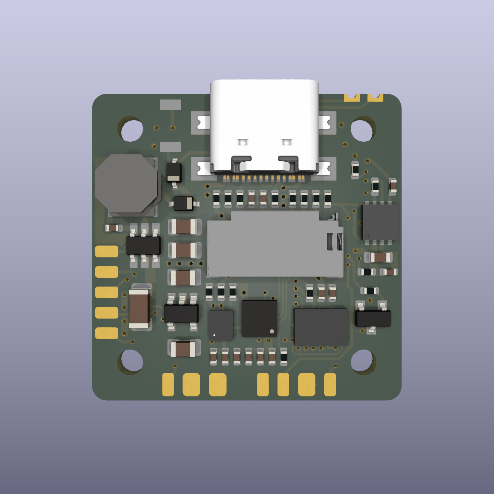
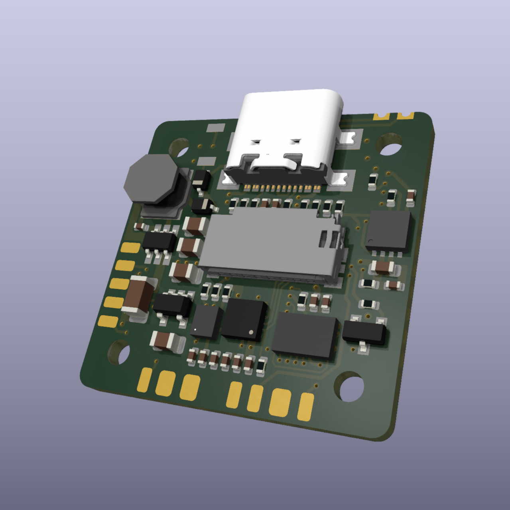

# Mint

Mint Flight Controller Board is compact under a 27 mm square to fit on Micro/Nano class drones using a standard 20 x 20 mm mount. Despite the small form factor, it features a comprehensive set of IO interfaces for a wide range of peripherals.

This repository hosts the KiCAD project of the flight controller board.

> - The PCB design is still under completion. This board has never been built and tested.
> - Firmware for this target does not exist yet.

## Specifications

- **Processor and Sensors**
  - STM32H723VIH6 MCU
  - ICM20602 and BMI088 IMUs
  - DPS310 Barometer

- **Interfaces**
  - 10x PWM outputs (8 for motors and 2 for peripherals)
  - 1x RC input (UART 1)
  - 1x I2C bus for external sensors
  - 1x CAN bus for external sensors
  - 5x UARTs
  - 4-in-1 ESC interface for Motor outputs 1-4
  - DJI Air Unit interface (UART 8)
  - 3x GPIO pins

- **Power**
  - (4V - 32V) voltage input (2S-7S)
  - Onboard 5V, 2A BEC for low-power peripherals

- **Physical Dimensions**
  - 26.5 x 26.25 mm
  - 20 x 20 mm mount pattern

## Images

<em>
Top
</em>

<em>
Top 3D
</em>

<em>
Bottom
</em>

<em>
Bottom 3D
</em>
